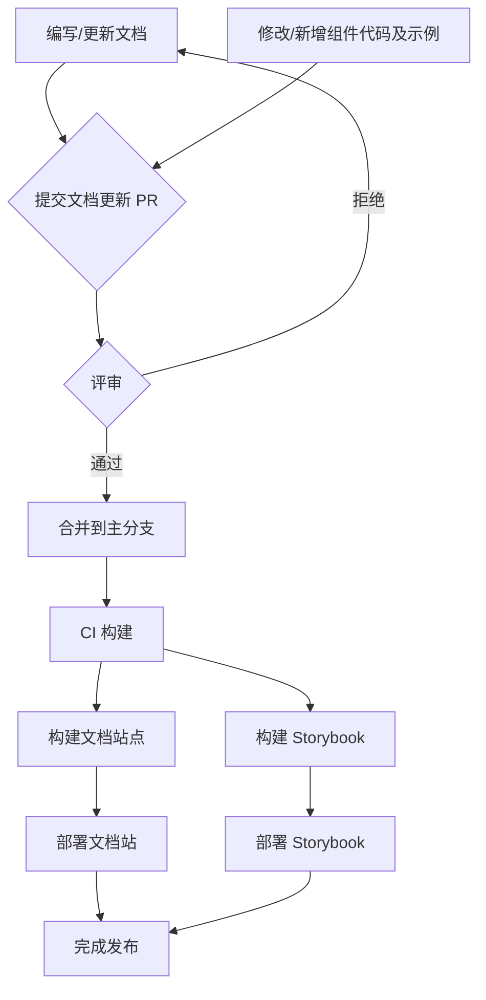

# 执行摘要

针对公司级文档站的需求，本报告提出了全面的设计方案：以前端工程师、设计师、产品经理和文档维护者为主要受众，构建统一的组件库、配置库和工具库文档，采用类似 Ant Design 官网的视觉风格，并集成 Storybook 实现交互式示例和调试。**信息架构**层面，将设置清晰的目录层级（如组件库、配置库、工具库、指南、FAQ、变更日志等），提供全局导航、搜索、版本切换和多语言支持，同时考虑访问权限控制和审计日志。**内容类型**包括组件 API 文档、代码示例、最佳实践、无障碍性说明，以及配置说明、工具使用指南、迁移指南、常见问题和变更日志等。**交互示例**将通过 Storybook 集成，支持嵌入或链接方式展示可交互演示，并利用控件面板和参数化示例实现实时预览和调试，同时提供沙箱环境、代码编辑/复制功能与运行时隔离等。**技术选型**上，将比较多种文档框架（Docusaurus、VitePress、Next.js/Nextra 等）和组件方案，考虑使用 React+TypeScript、样式方案与 MDX 支持，集成 Algolia 搜索、CI/CD 自动化、性能优化等。**开发维护**方面，会明确内容贡献与审核流程，使用自动化测试（视觉回归、可访问性）确保质量，制定版本发布与示例同步策略。**设计规范**将参考 Ant Design 文档的视觉风格，实现响应式和无障碍设计，使用设计系统的 tokens 定义主题，并支持亮暗模式切换。**安全控制**将通过公司单点登录（SSO）或 VPN 限制内部访问，并做好权限管理。最后，将提出分阶段实施计划，包括项目里程碑、资源估算、风险分析及缓解措施。本报告综合考虑可行性、成本与维护复杂度，为公司内部搭建统一、规范、交互丰富的文档平台提供可落地的实施方案。

## 目标与受众

- **目标**：建立一套综合性的在线文档平台，覆盖公司内部的组件库、公共配置库和工具库，以提升文档可维护性、团队协作效率和开发体验。文档站需视觉美观、交互丰富、可搜索、易于扩展，并保持与业务代码的同步更新。
- **主要受众**：前端工程师（查阅组件 API、示例和最佳实践）、设计师（了解组件设计规范）、产品经理（查看组件功能和使用指南）、文档维护者（编写和审阅文档）、运维人员（关注部署和权限需求）等。

## 信息架构

- **目录层级与导航**：采用清晰的目录结构，示例顶层栏目包括：**快速开始**、**组件库**、**配置库**、**工具库**、**指南**（如迁移指南、使用指南）、**常见问题**、**变更日志**等；每个大类下再细分子类目。界面右侧或左侧固定“文档目录”边栏展示章节层级，顶部导航或面包屑体现全局结构。示例如下：
  - 快速开始
  - 组件库
    - 输入组件（Input, Select, DatePicker…）
    - 数据展示（Table, List, Tree…）
    - 弹框组件（Modal, Drawer…）
    - ……
  - 配置库
    - 全局主题配置
    - 环境变量与配置
    - 网络请求配置
    - …
  - 工具库
    - CLI 工具（安装、使用）
    - 调试工具（指南）
    - 代码生成器
    - …
  - 指南与教程
    - 开发指南
    - 迁移指南（版本升级）
    - 设计规范
    - …
  - 常见问题 (FAQ)
  - 变更日志 (Changelog)
- **搜索功能**：集成全文搜索，例如 [Algolia DocSearch](https://www.algolia.com/)（支持文档和代码关键词搜索），也可选用 Lunr.js 等开源搜索。保证搜索框全局可见，支持多语言搜索和版本切换搜索，能快速定位到组件或关键词。
- **版本管理**：支持多版本文档，当组件库有重大版本（如 v1、v2）时，用户可通过版本切换菜单选择对应版本的文档。版本机制自动复制历史文档内容，便于旧版查阅与差异对比【72†L1-L4】（按语义化版本发布）。
- **多语言支持**：文档系统应支持国际化(i18n)，至少中文和英文两种语言界面切换。框架层面需配置国际化插件或目录结构（如 `docs/zh/`、`docs/en/`），并提供语言切换开关。推荐使用现成支持多语言的方案，如 Docusaurus 和 VitePress 都提供内置 i18n 功能【53†L7-L9】。
- **访问控制与权限**：由于是内部文档，可通过公司网络或 VPN 限制访问；同时集成单点登录（SSO）机制（如基于 SAML、OAuth 或 LDAP）使用户凭公司账号访问。前端可以针对不同身份显示不同内容，例如只有开发者组能看到 CLI 工具细节等。
- **审计与变更历史**：通过版本控制系统（如 Git）记录文档修改历史。文档站可显示最后更新日期和作者，或集成审计系统（如 Commit 信息同步显示）。对于重要文档，可维护一个专门的**文档更新日志**页面，记录文档改动记录，便于审计。

## 内容类型与模板

- **组件文档**：每个组件页提供统一模板，包括：组件简介、功能说明；**API 参考**（属性 Props、事件 Events、样式变量、方法等详细列表）；**示例展示**（多个使用示例，含运行结果和代码）；**最佳实践**（使用建议、常见用例）；**设计规范**（设计师注释、视觉规范）；**可访问性**（ARIA 属性、键盘交互说明）等。示例可包含代码编辑和演示效果，便于读者直观学习。模板示例：
  ```mdx
  # Button 按钮组件
  *简要说明按钮用途及类型。*

  ## 示例
  <!-- 在文档中嵌入 Storybook 交互示例 -->
  <Story name="默认按钮">
    <Button>普通按钮</Button>
  </Story>
  <Story name="主要按钮">
    <Button type="primary">主要按钮</Button>
  </Story>

  ```jsx
  // 使用示例代码
  <Button type="primary">主要按钮</Button>
  ```

  ## API
  | 属性 | 说明 | 类型 | 默认值 |
  |-----|-----|-----|-----|
  | `type` | 按钮类型，可选 `primary` `default` 等 | string | `default` |
  | `onClick` | 点击回调 | function | - |
  | ...  | ...  | ...  | ...  |

  ## 注意事项
  - 按钮应始终提供可读的文本标签，保证无障碍性。
  - 禁用状态下按钮呈现灰色，不可交互等。
  ```
- **配置库说明**：对内部公共配置进行文档化，包括全局配置项列表、默认值、作用说明、示例等。例如全局主题色配置、Axios 请求库配置、环境变量等。提供**配置项表格**和**示例代码**说明如何在项目中使用和修改配置。
- **工具使用指南**：对开发或运维工具（如命令行工具、内部 SDK、调试插件）的使用方法进行说明。每个工具页包括安装步骤、主要命令/接口说明、示例使用、注意事项等。
- **迁移指南**：当组件库或配置库有重大版本升级时，提供迁移文档。例如从 v1 升级到 v2 的区别列表、重构方案、兼容性说明、自动化脚本使用等指导。按版本编写清晰步骤，帮助用户平滑过渡。
- **常见问题 (FAQ)**：汇总用户常见问题及解答，如使用常见误区、问题排查思路、文档未覆盖的特殊示例等。使用问答列表形式，关键字可被搜索到。
- **变更日志 (Changelog)**：记录每个版本发布内容，包括新增特性、修复 BUG、重大变更等。格式可参考语义化版本说明，方便用户了解版本演进。每次文档更新也可同步更新变更日志。

## 交互示例与调试

- **Storybook 集成方案**：推荐采用 Storybook 作为组件交互示例平台。可选方案包括：将 Storybook 作为文档站的子模块，通过 iframe 嵌入示例；或使用 Storybook 的 Docs Addon 直接在文档页面内以 MDX 形式渲染故事（需安装 `@storybook/addon-docs`）【59†L1-L6】。如果文档站和组件库在同一个 mono-repo 中，可配置统一 Storybook 实例。采用 Storybook 的**独立 iframe 环境**保证示例运行时依赖隔离，支持热重载与控件面板。示例步骤：
  1. 在组件项目中安装并初始化 Storybook：`npx sb init`。
  2. 安装必要插件：`npm install --save-dev @storybook/addon-docs @storybook/addon-controls @storybook/addon-essentials`等。配置 `.storybook/main.js`，确保包含 `docs` 和 `controls`。
  3. 在文档框架（如 Docusaurus）中安装 Storybook 插件：`npm install --save-dev storybook-addon-docusaurus`（Docusaurus 专用）或查找对应框架的 Storybook 集成方案。
  4. 在 .mdx 文档文件中嵌入故事。例如在 Docusaurus MDX 中：
     ```mdx
     import { Story } from '@storybook/addon-docs';
     import { Button } from '@company/ui';
     <Story name="默认按钮">
       <Button>示例按钮</Button>
     </Story>
     ```
     这样文档页面会渲染可交互的按钮示例【59†L1-L6】。
  5. 配置构建流程：`npm run build-storybook` 生成 Storybook 静态文件到 `storybook-static`。在 CI/CD 中增加构建 Storybook 步骤，并将生成产物部署到文档服务器或统一托管域名。
  6. 示例代码展示：文档中不仅要嵌入可运行示例，还应提供对应的源代码片段，可通过内置代码高亮组件显示，支持一键复制。
- **热重载与控件面板**：开发模式下，Storybook 提供热更新，文档修改或代码变更可即时看到效果。控件面板允许用户动态修改组件属性（Props），实现参数化示例，以展示组件在不同配置下的行为。
- **沙箱环境**：可利用在线代码沙箱（如 CodeSandbox、StackBlitz）的嵌入功能，提供即时编辑和运行的完整项目示例；也可以考虑内置 Monaco 编辑器（VSCode 编辑体验）在文档中编辑示例代码，实时预览效果。
- **运行时依赖隔离**：通过 Storybook 的 iframe 沙箱，每个组件示例隔离于主文档环境，可独立加载依赖，避免全局冲突。这也允许在示例中引入外部库或上下文（如 Redux、React Router 等）进行更复杂的演示。
- **示例同步策略**：为了保证示例代码与实际组件行为一致，可将 Storybook 中的 demo 代码与文档示例共用源头。如将示例写在一个单独的 `.mdx` 或 `.story.jsx` 文件中，在文档中通过引用或导入来同步展示，避免重复编写。更新组件或故事时，文档示例会自动更新。

## 技术选型与架构

- **文档框架**：
  - **轻量级方案**：使用 Docsify、VuePress 或 VitePress 等轻量静态站生成器。Docsify 无需预构建，使用纯前端加载 Markdown；VitePress 基于 Vite，构建速度快。优点在于部署简单、渲染速度快，适合内容导向、示例较少的场景。但可能缺乏内置版本管理和高级插件，需要自行扩展。适合预算有限、需求简单的项目。
  - **平衡方案**：采用 Docusaurus 或 Next.js+MDX（如 Nextra）等成熟框架。Docusaurus 原生支持版本管理、国际化、Algolia 搜索等【53†L7-L9】；主题可定制性强，社区活跃。Next.js+MDX 则具有更多灵活性，可结合 React 生态任意扩展。此类方案功能齐全、用户体验好，适合常规团队使用。维护成本和学习成本属于中等。
  - **企业级方案**：构建高度定制化平台，如基于 Next.js + Headless CMS（如 Strapi、Contentful）实现内容管理，或使用商业文档平台（Confluence+定制插件）。可以满足复杂权限、审计、动态内容需求，但成本高、开发量大。适用于大型组织或要求多部门协作的场景。
- **组件技术栈**：前端组件库建议使用 React + TypeScript，和 Ant Design 生态保持一致。样式方案可采用 CSS-in-JS（Emotion/Styled-Components）或 CSS Modules，配合自定义主题（暗黑模式、设计系统 tokens）。Ant Design 自带的主题定制和配色方案可借鉴，或使用类似 [dumi-theme-antd-style](https://github.com/arvinxx/dumi-theme-antd-style) 等现成主题实现亮暗色切换（可定制化）。
- **MDX 支持**：选用支持 MDX 的文档框架，使得文档内容可以无缝插入 React 组件（如交互示例、提示组件）。MDX 允许将文档视为 React 组件，使示例与文本混合展示。例如 Docusaurus 和 Next.js 均支持 MDX。
- **全文搜索**：集成像 Algolia DocSearch 这样的专业文档搜索引擎，确保搜索速度和相关度。Algolia 提供免费计划给开源文档；对于私有部署，可使用 ElasticSearch 或者 Algolia 企业版。搜索支持中文分词和多语言索引，提升查找效率。
- **CI/CD 与部署**：使用 GitHub Actions、GitLab CI 或 Jenkins 等自动化工具。CI 流程包括：拉取代码、安装依赖、生成静态文档和 Storybook、执行测试（见下一节），最后部署到静态托管服务。部署可选择公司内部服务器、AWS S3/CDN、Netlify、Vercel 等。监控方面，可以使用服务监控（如 Uptime Robot）检测文档站可用性，用 Lighthouse 分析页面性能。
- **性能优化**：静态站点本质下，通过预渲染生成纯 HTML，加载快速。应开启 HTTP 缓存、CDN，加速静态资源。对于示例和图像资源，使用懒加载。构建时开启 Tree Shaking，尽量减少打包体积。代码高亮、数学公式等插件开销也需评估。
- **监控与统计**：可集成前端监控（如 Google Analytics、百度统计）监测访问量、热门页面；也可收集搜索关键词热度，用于优化文档结构。若有登录系统，可记录用户行为（阅读频率、下载情况）供团队迭代。

## 开发与维护流程

- **内容贡献流程**：采用“文档即代码”的方式，文档源文件存放于版本库（如 Git）。开发者/撰写者通过 Fork + Pull Request 提交文档更新，由文档维护者或审阅者审核合并。文档团队需制定规范（内容模板、命名约定、术语标准等），并在 PR 中检查格式（可使用 lint 工具，如 markdownlint）。
- **审核流程**：所有变更通过合并请求进行代码评审，不允许直接推送至主分支。评审者需检查内容准确性、格式一致性、代码示例正确性等。可设定不同人员审核，如技术负责人审阅技术内容，编辑团队审阅语言规范。
- **自动化测试**：
  - **构建测试**：CI 在合并时自动构建文档站和 Storybook，确保无构建错误。构建失败应禁止合并，保证文档站始终可用。
  - **视觉回归**：对关键示例页面（尤其组件展示页面）可引入视觉回归测试工具（如 Chromatic、Percy）捕捉不经意的样式变动。
  - **可访问性测试**：使用自动化工具（如 axe-core、Lighthouse）检查页面可访问性问题，如色差、标签缺失、键盘导航等，并将报告反馈给开发者。
- **版本发布策略**：文档发布应与组件/配置库版本联动。例如使用 Git Tag 或语义化版本发布工具（如 lerna、semantic-release），每次组件库发布新版本时触发相应文档分支的生成。文档站可以保留历史版本供用户切换，或通过分支管理不同主线版本。
- **示例同步策略**：维护组件示例和文档示例的一致性。可通过把示例定义在 Storybook 的源文件中，然后在文档中引用。这意味着更改组件或故事后，只需更新一个地方即可同步到文档示例，无需双写。CI 中可检查示例代码与文档代码块的一致性。

## 设计与可用性

- **视觉风格**：参考 Ant Design 文档的设计语言（简洁的布局、大量留白、明晰的层级结构），使用统一的 UI 组件库（可使用 Ant Design React 组件或自建组件）构建文档界面。包括表格、按钮、Tabs、代码块、警告框等常用元素，保证与产品界面风格一致。
- **响应式设计**：文档站应对移动端和不同分辨率进行适配（百分比布局、媒体查询等），在手机或平板上也能良好阅读。侧边栏在小屏幕应自动隐藏或以抽屉方式显示。
- **可访问性标准**：遵循 WCAG 无障碍指南，保证文字对比度、ARIA 标签、键盘可操作性。示例中注重示范正确的无障碍属性（例如 button 应具备合理的 `aria-label` 或有文本标签）。文档中可设立可访问性提示区块，提醒用户注意事项。
- **设计系统与 Tokens**：建立统一的设计系统规范，包括颜色、排版、间距等 tokens。将设计 token 以 CSS 变量或主题配置的方式注入文档站和组件库，使得主题定制统一。例如使用 Ant Design 的 Less 变量或 CSS 变量管理主题色系，并支持亮暗两套风格切换。
- **主题定制**：支持亮色/暗色模式切换。考虑到阅读舒适度，可自动跟随用户系统主题，或提供手动切换开关。主题切换应保持组件示例风格一致，并对代码块、背景、文本颜色等统一切换。可采用 dumi 等工具提供的主题插件（如 dumi-theme-antd-style）实现一键切换【77†L1-L6】。
- **用户体验**：增加目录折叠动画、跳转预加载、滚动进度条等小优化，提升阅读体验。页面性能需保持快速响应，避免阻塞式脚本。文档排版应简洁易读，段落长度适中，代码示例可选深色/浅色主题以照顾不同用户习惯。

## 安全与权限

- **内部访问控制**：由于是公司内网文档，部署环境应保证只有公司网络或 VPN 用户可访问。可在部署位置（如内部服务器、云 VPC）配置防火墙，或者在应用层加入身份验证中间件。
- **私有部署**：建议将文档站部署在公司内部服务器或私有云平台。可使用 Docker 容器部署静态站点服务，如 Nginx 或使用专门的文档托管工具。如果对外网不可见，可进一步加固。
- **单点登录集成**：与企业身份系统（如 LDAP、Okta、Azure AD）集成，实现单点登录（SSO）。用户登录后可无缝访问文档站，角色权限可在内网通过分组控制。例如，使用 OAuth/OpenID Connect 验证入口，必要时限制某些页面仅特定用户组可见。
- **权限策略**：对敏感内容（如发布流程、安全配置等）可设置额外的权限检查。在编写文档时标明内部级别，仅向需要的角色开放。同时，对 CI/CD 管道和代码仓库的访问也应控制，避免无关人员修改文档源。

## 迁移与落地计划

- **分阶段实施**：项目可拆分为多个阶段：
  1. **规划与原型**：确定目标、设计信息架构，选型文档框架和技术；开发简单原型页面，收集反馈。  
  2. **基础平台搭建**：搭建基础文档站（如 Docusaurus/VitePress 项目），配置导航、搜索、主题与权限等基础功能；实现组件文档示例模板。  
  3. **Storybook 集成**：为组件库编写 Storybook，配置自动构建；在文档中嵌入交互示例。完成示例同步策略。  
  4. **多语言与版本管理**：根据需求增加英文文档，配置版本切换机制；完善访问权限和审计功能。  
  5. **优化与发布**：完善内容（FAQ、迁移指南等），优化视觉与可访问性测试；进行上线部署和用户培训。  
- **人力与时间估算**：根据模块划分，可初期投入 2-3 名前端工程师（负责文档平台搭建和 Storybook）、1 名文档专员（撰写和审核内容）、1 名后端/运维工程师（CI/CD 和部署）。**初版 MVP**可在 1-2 个月内完成（基础结构+核心组件文档），**完整平台**（包含所有组件和工具文档、多语言等）预计 3-6 个月，视团队规模而定。
- **风险与缓解措施**：
  - **内容质量风险**：文档撰写质量参差不齐。*缓解：*制定文档风格指南、示例模板，定期组织评审培训。
  - **技术选型风险**：选型复杂度过高导致进度拖延。*缓解：*先搭建可行性原型，评估框架成熟度；优先使用成熟工具。
  - **工具兼容风险**：Storybook 与文档框架兼容问题。*缓解：*采用官方或社区方案测试验证；必要时使用 iframe 嵌入备选方案。
  - **部署与访问风险**：企业安全策略导致无法访问外部服务（如 Algolia）。*缓解：*提前与安全团队沟通，考虑内部部署或白名单。
  - **维护成本风险**：更新迭代频繁，维护负担大。*缓解：*建立清晰的发布流程和自动化测试，保持示例与代码同步，降低手工维护成本。

## 技术选型对比

| 方案       | 技术选型示例                               | 优点                                           | 缺点                                              | 适用场景                              | 估算成本  | 维护复杂度  |
|----------|-----------------------------------------|----------------------------------------------|-------------------------------------------------|-------------------------------------|-------|--------|
| **轻量级**   | Docsify、VitePress（VuePress）等               | - 上手简单、部署快速<br>- 构建速度快、文件体积小<br>- 文档库开销低 | - 功能相对简单，缺少内置版本管理和完善插件<br>- 交互示例集成麻烦，需要自定义很多功能 | - 小型项目或初期试点<br>- 文档内容以说明为主、示例较少时使用 | 低     | 低      |
| **平衡型**   | Docusaurus、Next.js+MDX (如 Nextra)等        | - 支持版本管理、国际化、Algolia 搜索等功能<br>- 社区活跃、插件丰富<br>- React+MDX，可嵌入组件 | - 构建体积较大，学习和配置复杂度中等<br>- 需要维护构建过程和依赖          | - 中小型团队或需要丰富功能时<br>- 拥有专门文档维护流程的团队  | 中     | 中      |
| **企业级**   | 定制化 Next.js 平台+Headless CMS、Confluence+插件等 | - 功能全面（权限、审计、可视化编辑等）<br>- 灵活度高，可与内部系统深度集成 | - 开发投入大、部署成本高<br>- 需自行开发和维护较多功能             | - 大型企业级项目<br>- 文档需与业务系统打通、要求高定制化   | 高     | 高      |

## Storybook 与文档框架集成步骤

1. **安装 Storybook**：在组件库项目根目录运行 `npx sb init`，选择适合的框架（如 React）。  
2. **配置 Storybook**：在 `.storybook/main.js` 中设置 stories 路径和 addons，例如：
   ```js
   module.exports = {
     stories: ['../src/components/**/*.stories.@(js|jsx|ts|tsx|mdx)'],
     addons: ['@storybook/addon-essentials', '@storybook/addon-docs'],
     framework: '@storybook/react',
   };
   ```
3. **编写故事 (Stories)**：按照 [Component Story Format (CSF)] 写故事文件，如 `Button.stories.jsx`，定义组件示例和参数。也可使用 MDX (`.stories.mdx`) 来混合文档和示例。
4. **安装 Docs 插件**：确保安装 `@storybook/addon-docs`，并在 `.storybook/main.js` 的 addons 列表中包含它，以启用文档模式和 `<Story>` 组件使用。
5. **集成文档站**：
   - *Docusaurus 示例*：安装 `storybook-addon-docusaurus`：  
     ```bash
     npm install --save-dev storybook-addon-docusaurus
     ```  
     在 `.storybook/main.js` 添加：  
     ```js
     addons: [
       '@storybook/addon-essentials',
       'storybook-addon-docusaurus'
     ],
     ```  
     在 Docusaurus `.mdx` 文档文件中嵌入故事，例如：
     ```mdx
     import { Story } from '@storybook/addon-docs';
     import { Button } from '@company/ui';
     # 按钮组件
     <Story name="默认按钮">
       <Button>示例按钮</Button>
     </Story>
     ```
   - *VitePress/Docsify 示例*：由于无专用插件，可通过 iframe 将 Storybook 部署后的静态页面嵌入。或使用 `<iframe>` 手动链接 Storybook 页面：  
     ```html
     <iframe src="https://story.example.com/?path=/story/button--primary" style="width:100%; height:400px;" />
     ```  
6. **热重载和控件**：运行 `npm run storybook`，开发过程中 Storybook 自动热更新。确保 `addon-controls` 配置正确，让属性可在 UI 控制面板上调节。  
7. **构建与发布**：在 CI/CD 中添加命令：  
   ```bash
   npm run build-storybook   # 生成静态 Storybook
   npm run build             # 构建文档站
   ```  
   将生成的 `storybook-static` 和文档站构建产物分别部署到服务器或托管服务，可合并部署到不同路径或子域。

## 推荐目录结构示例

一个可能的 monorepo 目录结构如下（使用 Docusaurus 和 Storybook 为例）：

```
my-docs-project/
├── docs/                     # 文档内容
│   ├── quickstart.md
│   ├── components/           # 组件库文档
│   │   ├── Button.md
│   │   ├── Table.md
│   │   └── ...
│   ├── config/               # 公共配置文档
│   │   └── index.md
│   ├── tools/
│   │   └── cli-tool.md
│   ├── migration/
│   │   └── v1-to-v2.md
│   ├── faq.md
│   └── changelog.md
├── src/                      # 组件库源代码
│   └── components/
│       ├── Button/
│       │   ├── index.tsx
│       │   ├── Button.stories.tsx
│       │   └── Button.md   # 可选的 MDX 文档
│       └── Table/
│           ├── index.tsx
│           ├── Table.stories.tsx
│           └── Table.md
├── .storybook/               # Storybook 配置
│   ├── main.js
│   └── preview.js
├── docusaurus.config.js      # Docusaurus 配置文件
├── sidebars.js               # Docusaurus 侧边栏配置
├── package.json
└── README.md
```

**MDX/组件示例代码片段**（以 Button 组件为例）：

```mdx
import { Meta, Story, Preview, Props } from '@storybook/addon-docs';
import { Button } from '@company/ui';

<Meta title="组件/按钮 Button" component={Button} />

# Button 按钮组件

按钮用于触发一个操作或事件。

<Preview>
  <Story name="默认按钮 Default">
    <Button>默认按钮</Button>
  </Story>
  <Story name="主要按钮 Primary">
    <Button type="primary">主要按钮</Button>
  </Story>
</Preview>

<Props of={Button} />
```

此片段示例了在 MDX 中使用 `Meta`、`Story`、`Props` 等 Storybook Docs 组件来定义文档结构，自动生成属性表格，并在页面中渲染交互示例。

## 部署与 CI/CD 示例

示例：使用 GitHub Actions 部署文档站与 Storybook 到 GitHub Pages。配置 `.github/workflows/deploy.yml`：

```yaml
name: Build and Deploy Docs

on:
  push:
    branches: [ main ]

jobs:
  build:
    name: Build and Deploy
    runs-on: ubuntu-latest
    steps:
      - uses: actions/checkout@v2
      - name: Use Node.js 18
        uses: actions/setup-node@v3
        with:
          node-version: '18'
      - name: Install dependencies
        run: npm ci
      - name: Lint and Test
        run: |
          npm run lint
          npm run test
      - name: Build Storybook
        run: npm run build-storybook
      - name: Build Docs Site
        run: npm run build
      - name: Deploy Storybook to Pages
        uses: peaceiris/actions-gh-pages@v3
        with:
          deploy_key: ${{ secrets.DEPLOY_KEY }}
          publish_dir: ./storybook-static
          publish_branch: gh-pages-stories
      - name: Deploy Docs to Pages
        uses: peaceiris/actions-gh-pages@v3
        with:
          deploy_key: ${{ secrets.DEPLOY_KEY }}
          publish_dir: ./build
          publish_branch: gh-pages-docs
```

该示例中，CI 在主分支推送时触发：先执行 lint/test，接着分别构建 Storybook（输出到 `storybook-static`）和文档站（输出到 `build`），然后使用 `actions-gh-pages` 将两个目录推送到各自的 GitHub Pages 分支。部署时可配合自定义域或 GitHub Pages 环境设置。

## 内容发布与示例同步流程



图示流程描述了开发者更新文档或组件代码后发起 Pull Request，经过评审通过后，CI 自动构建文档站和 Storybook，然后部署上线。文档更新与示例同步都在同一个流程中进行，确保文档内容和交互示例的一致性。具体步骤包括：

- **开发阶段**：文档作者和开发者分别编辑文档（MDX/Markdown）和组件示例（Storybook stories）。
- **代码评审**：提交 PR 后由负责人员审批，确保文档格式与内容准确、示例可用。
- **CI 构建**：合并后触发自动化流程，同时构建最新文档站和 Storybook。
- **部署上线**：将构建结果部署到预生产/生产环境，更新 CDN 缓存，向团队发布文档更新通知。
- **示例同步**：同一流程内，将 Storybook 的示例自动包含在文档中，实现示例与文档双向同步。

该流程保障了文档发布的高效性和示例的及时更新，同时通过审查机制和自动化测试降低出错风险。

**总结**：以上方案综合了信息架构、内容设计、交互示例、技术选型、安全等多方面内容，为构建精美且功能完备的公司级文档平台提供了系统性指导。通过合理规划和分阶段实施，可有效平衡成本与效果，逐步落地可维护、高质量的内部文档体系。